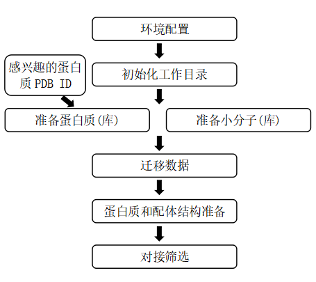

## 基于结构的虚拟筛选框架
**Version:1.0**

---
### 使用指南
- 概述
1. 概念：基于结构的虚拟筛选（Structure-Based Virtual Screening），是指基于受体的三维结构，利用分子对接技术从含有大量化合物小分子的数据库中，筛选出对接得分靠前的化合物作为潜在药物的计算辅助药物设计的方法。与实体药物筛选方法相比，具有成本低、速度快且通量大的优势。反向虚拟筛选（ Inverse Virtual Screening），顾名思义，是利用分子对接筛选蛋白质数据库，从而识别配体潜在的靶标的方法。药物虚拟筛选与实验筛选结合，能优势互补，现已成为先导化合物发现的一种经典且高效的方法。
2. 框架介绍：主要包括蛋白质库构建、小分子库构建、蛋白质和小分子对接结构准备以及对接分析等功能模块；通过将这些模块整合在一个框架中，有助于研究人员快速部署正（反）向虚拟筛选以发现感兴趣的结果。对接分析主程序是AutoDock Vina (v1.1.2)，具有计算速度快，可靠性高的特点；蛋白质结构和小分子结构使用 AutoDockTools(v1.4.5)进行对接准备；依赖Protein Data Bank (PDB) 数据库。
3. 分析流程：  

- 各模块功能介绍
> ini.py, 配置文件  
> initialize.py, 初始化工作目录  
> migrate.py, 迁移数据  
> proteinParser.py, 蛋白质库构建  
> ligandParser.py, 小分子库构建  
> structPreparer.py, 蛋白质和小分子结构准备  
> vsFlow.py, 正（反）向虚拟筛选  

- 使用方法
1. 软件配置：  
打开ini.py文件，配置MGLTools、OpenBabel软件安装目录，以及AutoDock Vina软件路径，例如：  
> #配置文件  
> #配置 MGLTools、OpenBabel的安装目录  
> MGL_ROOT = r'E:\software\MGLtools'  
> OB_ROOT = r'E:\software\openbabel\OpenBabel-3.1.1'  
> #配置 Autodock Vina的路径  
> VINA = r'E:\software\Autodockvina\vina'  

2. 初始化工作目录  
新建一个空目录作为工作目录（**work**目录），命令行运行  
*python initiate.py*  
初始化工作目录，此时，工作目录下将生成如下目录：  
> work/  
> &emsp;protein/  
> &emsp;&emsp;protein_raw         #PDB 数据库获取的原始结构文件，pdb格式  
> &emsp;&emsp;protein_clean       #原始结构去除配体分子，水分子后保留的蛋白质结构文件（包含多聚体，不同物种的结构），pdb格式  
> &emsp;&emsp;protein_pdb         #清洗完毕的蛋白质结构文件，pdb格式  
> &emsp;&emsp;pocasa              #POCASA预测的蛋白质与配体结合口袋信息  
> &emsp;ligand/  
> &emsp;&emsp;ligand_raw          #配体小分子文件，pdb格式  
> &emsp;&emsp;ligand_pdb          #处理好的配体小分子（如能量最小化），pdb格式  
> &emsp;&emsp;ligand_prop         #配体小分子的性质  
> &emsp;screen/  
> &emsp;&emsp;protein_pdb         #清洗完毕的蛋白质结构文件，pdb格式  
> &emsp;&emsp;ligand_pdb          #处理好的配体小分子，pdb格式  
> &emsp;&emsp;protein_pdbqt       #准备好用于对接的蛋白质结构，pdbqt格式  
> &emsp;&emsp;ligand_pdbqt        #准备好用于对接的配体分子，pdbqt格式  
> &emsp;&emsp;confs               #vina对接使用的configure文件，与蛋白质一一对应  

3. 蛋白质（受体）结构或结构库的准备  
本框架提供了从Protein Data Bank（PDB）数据库下载蛋白质结构和信息的方法，只需用户提供感兴趣蛋白的PDB ID即可；同时，下载的蛋白结构将会做进一步的清洗工作，并生成结合口袋信息。具体的，切换到**protein**目录下命令行运行  
*python proteinParser.py -p [pdbid文件] -o [物种名称]*  
>参数说明：  
> -p，指定包含PDB ID的文件，每个PDB ID独占一行  
> -o，指定蛋白质物种，考虑到有的晶体结构中有多个物种的蛋白结晶，仅保留指定物种的蛋白，例如"Homo sapiens"，要注意的是，如果名称中包含空格，须使用双引号""引用整个名称  

4. 小分子（配体）结构或（结构库）的准备  
用户可自行准备小分子（库），结构文件可从PubChem、ChEMBL及ZINC等数据库获取，使用  
*python ligandParser.py*  
对小分子结构进行优化，并且获取小分子的一些分子性质信息（如分子量，亲疏水性等）。注意运行目录应该在**ligand**目录下

5. 迁移数据  
为了进行正（反）向虚拟筛选，需要将蛋白质结构文件以及相应的conf文件、小分子结构文件迁移至**screen**目录下，并将结构文件从pdb格式转换到pdbqt格式做好对接准备。在**work**目录下使用  
*python migrate.py*  
完成数据迁移  

6. 蛋白质和小分子结构文件的准备
完成数据迁移后，切换到**screen**目录下，运行  
*python structPreparer.py -s [protein|molecule]*  
完成蛋白质和小分子结构的批量装换，做好对接准备  
> 参数说明：  
> -s protein #准备蛋白质结构  
> -s molecule #准备小分子结构  

7. 基于Vina对接的虚拟筛选
完成上诉步骤后，便已准备好对接所需的所有文件，分别是：蛋白质（受体）pdbqt格式结构文件，位于**protein_pdbqt**目录；小分子（配体）pdbqt格式结构文件，位于**ligand_pdbqt**目录；vina对接的configure文件，位于**confs**目录。另外，用户可通过MGLTools自行准备以上文件，并置于对应目录下进行对接分析。在**screen**目录下，运行  
*python vsFlow.py*  
对接分析完成后，将会在screen目录下生成**result_vina**目录，包含所有对接结果的构象文件；**result_score.txt**文件，为对接结果得分文件；**vina.log**为对接过程中的日志记录文件。

### 参考
- [Computational protein-ligand docking and virtual drug screening with the AutoDock suite](https://www.ncbi.nlm.nih.gov/pmc/articles/PMC4868550/)
- [Protein Data Bank](http://www.rcsb.org/)
- [AutoDock](http://autodock.scripps.edu/)
- [MGLTools](http://mgltools.scripps.edu/)
- [OpenBabel](http://openbabel.org/wiki/Main_Page)
- [POCASA](http://g6altair.sci.hokudai.ac.jp/g6/service/pocasa/)
- [python](https://www.python.org/)
